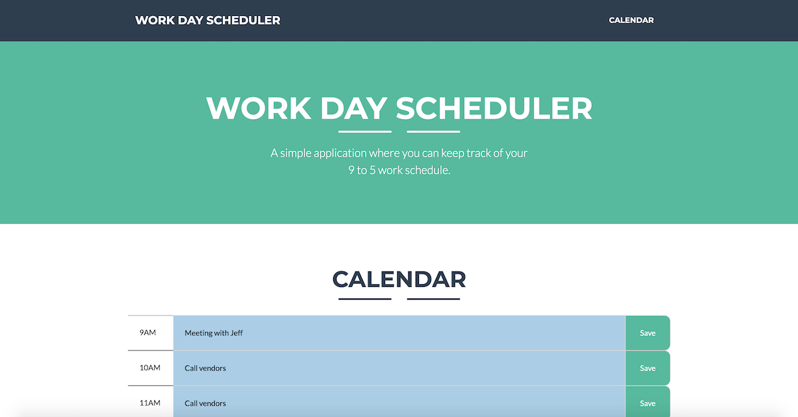

# work-day-scheduler

## Description

This application is a 9am to 5pm Work Day Scheduler built with:

-   HTML5
-   Bootstrap
-   Sass
-   Gulp
-   Javascript

With this app users can:

-   Use the 9am to 5pm calendar to store events and update events
-   Events are saved to localStorage, therefore use input won't be lost on page reload.

## Prerequisites

-   Web browser such as Google Chrome or Safari

## Installation

-   This application will run automatically when opened by any modern web browser like the ones listed above.

## Author

-   **Pablo Motta** - [github profile](https://github.com/pablomotta)

© 2020 Pablo Motta
